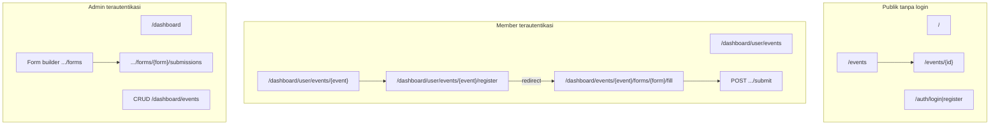

# Milestone M1–M4: sisa pekerjaan backend & alur bisnis

Dokumen ini melengkapi implementasi terbaru (Inertia/Vue): apa yang **sengaja tidak** dibuat karena **belum ada service/controller/migrasi** di backend, plus **alur web & bisnis** yang masih perlu diputuskan atau dikerjakan tim.

**Cara baca:** bagian “Status” memakai legenda: **Ada BE** (bisa dilanjut FE), **Perlu BE baru**, **Produk/kebijakan**.

---

## Ringkasan cepat

| Item | Status | Catatan |
|------|--------|--------|
| Lupa password (email reset) Inertia | **Perlu BE baru** | Belum ada route/controller `PasswordReset`; tidak diimplementasikan sesuai aturan “tanpa BE”. |
| Review submission (Accept / Reject) | **Perlu BE baru** | Tabel `form_answers` tidak punya kolom status review; UI tombol sudah ada dan memunculkan toast penjelasan. |
| Email konfirmasi / antrian penuh | **Ada BE parsial** | Ada job terkait registrasi di controller submit; detail di luar scope M1–M4 dokumen ini. |
| Publik daftar/detail event | **Ada BE** | `EventsController` kini mengirim event `published` ke halaman `Event` / `EventDetail`. |
| Satu jalur pendaftaran member | **Ada BE** | `/dashboard/user/events/{event}/register` diarahkan ke `FormFillController` (`Fill.vue`). |

---

## Alur web (setelah perubahan)

---

## Alur bisnis yang masih “kurang” atau perlu keputusan

### 1. Persetujuan pendaftaran (Accept / Reject)

- **Hari ini:** admin hanya melihat jawaban; tombol Accept/Reject memanggil **toast informasi** (tidak mengubah data).
- **Yang dibutuhkan:** misalnya kolom `review_status` (enum: `pending`, `accepted`, `rejected`) + timestamp + `reviewed_by` pada `form_answers`, policy, route `PATCH`, dan optional notifikasi ke member.
- **Alur bisnis target:** admin membuka submissions → memilih peserta → Accept/Reject → member melihat status di halaman event (butuh FE tambahan).

### 2. Lupa password

- **Hari ini:** hanya login/register Inertia + OAuth.
- **Yang dibutuhkan:** route guest `auth/forgot-password`, `auth/reset-password`, controller, Mailable atau Laravel default broker, halaman Vue, rate limit.

### 3. Multi-form per event

- **Hari ini:** redirect register memilih form **pertama** menurut judul; halaman fill memakai `{form}` eksplisit.
- **Keputusan produk:** jika satu event punya banyak formulir, perlu halaman “pilih form” atau tautan per form dari detail event.

### 4. Data dashboard member

- **Hari ini:** user tanpa `events.list` hanya melihat agregat dari **event published** (bukan seluruh event internal).
- **Opsi lanjutan:** KPI “Events Joined” di `Dashboard/Index.vue` masih angka statis — bisa dihubungkan ke query `form_answers` ketika BE siap.

---

## Perintah setelah pull (tim)

1. `composer update` — menghapus paket `livewire/*` dan `filament/*` dari `composer.json`.
2. `php artisan optimize:clear`
3. `npm install && npm run build` (atau `npm run dev`).

---

## Referensi

- [docs/milestone.md](milestone.md)
- [docs/milestone-m1-m4-post-implementation-analysis.md](milestone-m1-m4-post-implementation-analysis.md)
