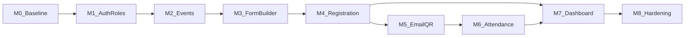

# Milestone — D-Form v2

**Tujuan dokumen:** memberi tahapan kerja yang jelas agar tim bisa **paralel** dengan dependensi terbaca, dan agar **migrasi UI dari Livewire ke Vue (Inertia)** tidak ditunda ke satu big-bang di akhir.

**Acuan produk:** [prd.md](prd.md).  
**Acuan teknis:** [README](../README.md), [pedoman front-end](rules/front-end.md), [pedoman back-end](rules/back-end.md).

---

## Diagram dependensi antar fase

- **M4 → M7** dan **M6 → M7**: dasbor dapat mulai diisi data dummy/contract API paralel dengan penyelesaian M4/M6, asal kontrak response disepakati di M0.

---

## Migrasi Livewire → Vue (lintas fase)

Modul yang masih memakai Livewire di repositori harus mencapai **parity perilaku** di halaman Inertia/Vue sebelum fitur tersebut dianggap “selesai” untuk milestone terkait:

- Setiap fase di bawah mencantumkan **Cek migrasi** — tim menghapus atau mengisolasi rute/view Livewire yang sudah tergantikan agar tidak ada dua sumber kebenaran untuk UX yang sama.
- Prioritas: **Auth** → **Event & form admin** → **Publik pendaftaran** → **Dasbor**.

---

## M0 — Baseline & arsitektur

| | |
|---|---|
| **Tujuan** | Satu cara yang jelas untuk menambah halaman Inertia, layout, i18n, dan naming; keputusan Filament vs full Vue. |
| **Owner (saran)** | Fullstack / lead |
| **Deliverable** | Konvensi route (`routes/web/*.php`), pemetaan `resources/js/pages/*`, penggunaan layout di `resources/js/layouts`; keputusan tertulis: apakah Filament dipakai untuk subset admin atau tidak; strategi branch/PR singkat (mis. satu PR per milestone kecil). |
| **Kriteria selesai** | Dokumen atau ADR mini di repo/wiki tim; contoh satu halaman baru dari nol mengikuti pola; tidak ada kebingungan “halaman ini Blade atau Vue?”. |
| **Paralelisasi** | Dokumentasi bisa jalan bersamaan dengan spike teknis M1. |
| **Cek migrasi** | Inventaris komponen Livewire yang menabrak rute yang sama dengan Inertia — daftar prioritas penghapusan. |

---

## M1 — Autentikasi & peran

| | |
|---|---|
| **Tujuan** | Login, register, lupa password di **Vue + Inertia**; middleware peran; area admin vs member terpisah. |
| **Owner (saran)** | FE utama + BE untuk policy & route |
| **Deliverable** | Halaman auth Vue; integrasi Spatie permission (atau pola yang dipakai proyek); redirect sesuai peran setelah login. |
| **Kriteria selesai** | Semua jalur auth utama lolos uji manual; tidak ada akses panel admin untuk role member pada route yang dilindungi. |
| **Paralelisasi** | Setelah kontrak user/session di Inertia stabil, M2 bisa mulai untuk CRUD event di branch terpisah. |
| **Cek migrasi** | Form login/register Livewire digantikan; view Blade khusus auth legacy tidak lagi menjadi jalur utama. |

---

## M2 — Manajemen event

| | |
|---|---|
| **Tujuan** | CRUD event lengkap sesuai PRD (judul, deskripsi, lokasi, tanggal event, buka–tutup pendaftaran, kuota); daftar, detail, status pendaftaran. |
| **Owner (saran)** | Fullstack |
| **Deliverable** | Controller + Form Request + halaman Inertia; model & migrasi selaras dengan `events` (dan relasi minimal). |
| **Kriteria selesai** | Admin dapat membuat event dan melihat daftar/detail; status pendaftaran konsisten dengan tanggal dan kuota. |
| **Paralelisasi** | Desain API/form field untuk M3 dapat dibahas setelah struktur `events` stabil. |
| **Cek migrasi** | Halaman daftar/detail/create event yang sebelumnya Livewire memiliki parity di Vue (`ListPage`, `EventDetail`, `CreateForm`, dll. sesuai kode). |

---

## M3 — Form builder dinamis

| | |
|---|---|
| **Tujuan** | Admin mengonfigurasi field per event: label, nama, tipe, urutan (sortable), aturan validasi. |
| **Owner (saran)** | FE (UI builder) + BE (skema simpan & validasi) |
| **Deliverable** | UI builder; persist ke `event_form_fields`; validasi server untuk konfigurasi (mis. nama field unik per event). |
| **Kriteria selesai** | Form dapat disusun dan disimpan ulang tanpa kehilangan urutan; tipe field sesuai PRD. |
| **Paralelisasi** | Mock data field untuk M4 jika penyimpanan M3 belum merge (hindari blokir panjang). |
| **Cek migrasi** | Modul form admin Livewire (`EditForm`, `FormDetail`, `create-form`, dll.) tergantikan atau diarahkan ke rute Vue. |

---

## M4 — Pendaftaran member

| | |
|---|---|
| **Tujuan** | Member memilih event, mengisi form dinamis, submit; data jawaban disimpan (JSON); upload file dengan validasi. |
| **Owner (saran)** | Fullstack |
| **Deliverable** | Render field dari definisi M3; `event_form_submissions`; storage file; validasi dinamis server-side mencerminkan rules admin. |
| **Kriteria selesai** | Satu alur pendaftaran end-to-end untuk semua tipe field MVP; gagal validasi menampilkan error per field. |
| **Paralelisasi** | Kontrak payload submission untuk M5 (email) dan M6 (QR menempel pada submission). |
| **Cek migrasi** | Tidak ada duplikasi form pendaftaran di Blade/Livewire untuk event yang sama. |

---

## M5 — Email & QR

| | |
|---|---|
| **Tujuan** | Email konfirmasi berisi detail event, data peserta, QR unik; antrean; log di `email_logs`. |
| **Owner (saran)** | BE + FE (template/preview opsional) |
| **Deliverable** | Job queue; Mailable; generate QR terikat submission ID; konfigurasi SMTP; entri log sukses/gagal. |
| **Kriteria selesai** | Pendaftaran sukses memicu email (via queue); QR dapat ditampilkan/diuji di email test. |
| **Paralelisasi** | Template email bisa dipoles paralel dengan M6 setelah payload QR final. |
| **Cek migrasi** | N/A khusus Livewire; pastikan trigger email dari controller/Inertia bukan dari komponen LW. |

---

## M6 — Absensi QR

| | |
|---|---|
| **Tujuan** | Admin memindai QR (kamera web); sistem mencatat waktu, event, submission, admin yang memindai. |
| **Owner (saran)** | FE (scanner UX) + BE (endpoint idempotent / aturan double-scan) |
| **Deliverable** | Halaman scan; decode QR → lookup submission; tulis `event_attendances`; aturan duplikasi (mis. tolak scan kedua atau izinkan dengan flag — **disepakati di PRD revisi kecil jika perlu**). |
| **Kriteria selesai** | Scan valid menambah baris kehadiran; scan tidak valid memberi pesan jelas. |
| **Paralelisasi** | Uji perangkat dapat dilakukan oleh QA paralel setelah API scan ada. |
| **Cek migrasi** | Fitur serupa di Livewire (jika ada) digantikan halaman Vue. |

---

## M7 — Dasbor & pelaporan

| | |
|---|---|
| **Tujuan** | Statistik pendaftar per event, kehadiran, daftar peserta, data absensi; ekspor MVP (mis. CSV). |
| **Owner (saran)** | FE (tabel/chart) + BE (query teroptimasi) |
| **Deliverable** | Halaman dasbor admin; filter per event; unduhan atau tampilan yang dapat di-screenshot untuk laporan sederhana. |
| **Kriteria selesai** | Angka yang ditampilkan konsisten dengan data di DB; ekspor dapat dibuka di spreadsheet. |
| **Paralelisasi** | Query report dapat ditulis setelah M4/M6 data tersedia; UI bisa memakai skeleton. |
| **Cek migrasi** | Widget dasbor Livewire digantikan Inertia/Vue. |

---

## M8 — Stabilisasi

| | |
|---|---|
| **Tujuan** | Kepercayaan rilis: tes, aksesibilitas dasar, dokumentasi operasional. |
| **Owner (saran)** | Seluruh tim |
| **Deliverable** | Tes fitur untuk jalur kritis (auth, daftar, email, scan); perbaikan bug P1; README/deployment tetap akurat. |
| **Kriteria selesai** | Daftar smoke test lolos; tidak ada regresi besar pada migrasi LW→Vue yang tersisa. |
| **Paralelisasi** | Bugfix diprioritaskan berdasarkan dampak user. |
| **Cek migrasi** | Dependensi Livewire/Volt dapat dievaluasi untuk dihapus dari `composer.json` jika tidak terpakai (keputusan terpisah setelah verifikasi). |

---

## Ringkasan paralelisasi yang aman

| Bekerja bersamaan | Syarat |
|-------------------|--------|
| M1 + spike M2 | Kontrak user & layout dasar jelas. |
| M3 UI + M2 API | Kontrak bentuk `event` dan `event_form_fields` disepakati. |
| M7 UI + M4/M6 | Mock JSON atau seed data; kontrak response dasbor. |
| Dokumentasi + fitur | Perubahan README hanya menyentuh bagian yang relevan agar tidak konflik merge. |

---

## Referensi

- [PRD — D-Form v2](prd.md)
- [README](../README.md)
